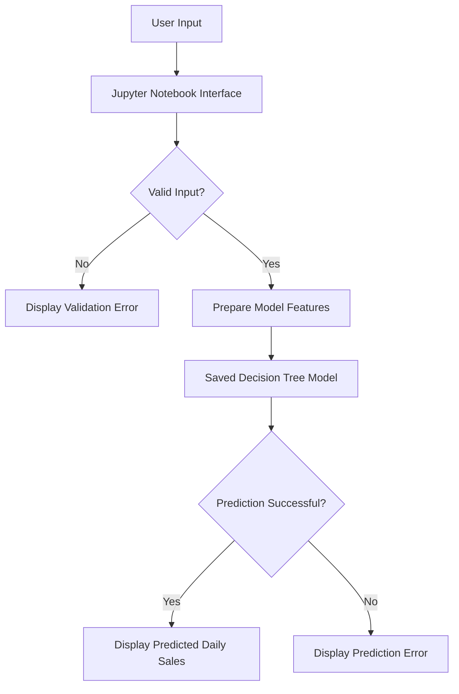

# BizInsight — System Architecture

```mermaid
flowchart TD
    A["User Input"] --> B["Jupyter Notebook Interface"]
    B --> C{"Valid Input?"}
    C -->|No| D["Display Validation Error"]
    C -->|Yes| E["Prepare Model Features"]
    E --> F["Saved Decision Tree Model"]
    F --> G{"Prediction Successful?"}
    G -->|Yes| H["Display Predicted Daily Sales"]
    G -->|No| I["Display Prediction Error"]
```